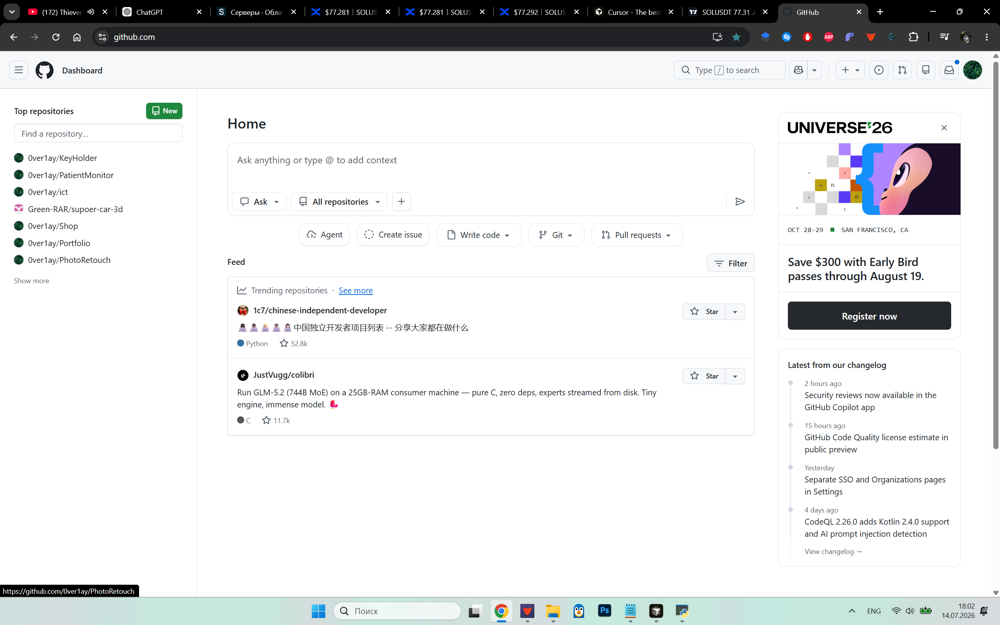
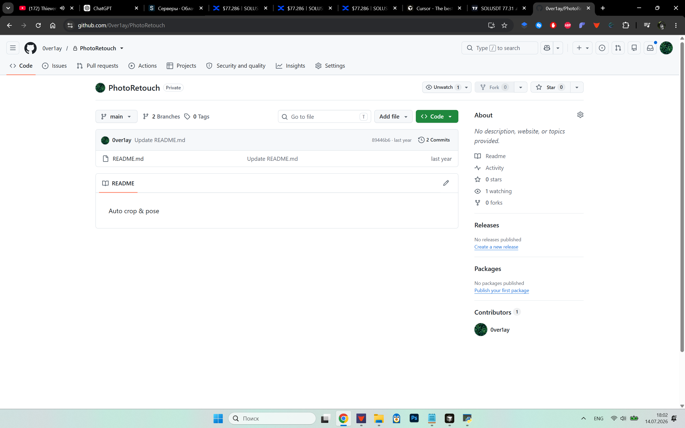
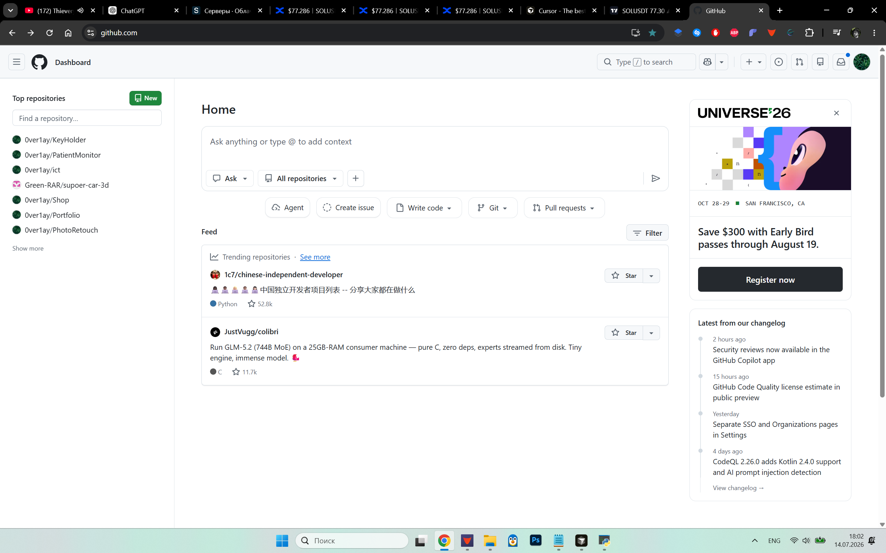
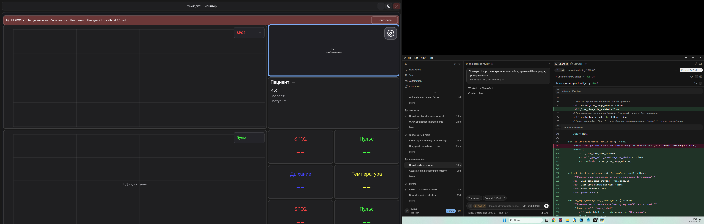

# PatientMonitor

Desktop-приложение для мониторинга витальных показателей пациентов  
**Python · Kivy · PostgreSQL**

> Демонстрационный / портфолио-релиз. Не является медицинским изделием.  
> Не используйте реальные клинические данные пациентов.

---

## Что это

Многооконный монитор коек: live-показатели, исторические графики, настраиваемые раскладки и экспорт в CSV / XLS / PDF / XML.

Стек заточен под Windows desktop и локальную/серверную PostgreSQL.

## Возможности

- **Мульти-койка** — несколько окон мониторов, сетки 2–8 панелей
- **Live-графики** — SpO₂, пульс, дыхание, температура, АД, газы и др.
- **История** — выбор исследования и временного диапазона, агрегация
- **Редактор раскладок** — пресеты и кастомные grid-layout
- **Экспорт** — CSV, SpreadsheetML, PDF (ReportLab), anesthesia XML
- **Offline UX** — при недоступной БД баннер и retry, без подмены фейковыми данными
- **Demo-режим** — синтетический генератор без PostgreSQL (по явному флагу)

## Скриншоты

| Главное окно | Монитор | Viewer | Offline |
|---|---|---|---|
|  |  |  |  |

## Архитектура

```
main.py / run_monitor_window.py / run_bed_viewer.py
        │
        ▼
┌───────────────────┐     ┌────────────────────┐
│  Kivy UI          │────▶│  DataSource ABC    │
│  components/      │     └─────────┬──────────┘
└───────────────────┘               │
                        ┌───────────┴───────────┐
                        ▼                       ▼
               DataGenerator              DatabaseDataSource
               (demo mode)                (PostgreSQL + pool)
```

Ключевые модули:

| Путь | Роль |
|------|------|
| `components/` | Экраны и виджеты (монитор, графики, раскладки, экспорт) |
| `utils/database_source.py` | Запросы к БД, latest + history |
| `utils/data_generator.py` | Синтетические live-сигналы |
| `utils/shared_db_pool.py` | Пул соединений PostgreSQL |
| `utils/signal_registry.py` | Реестр сигналов из конфига |
| `migrations/` | SQL-миграции (индексы для history/latest) |

## Быстрый старт

### 1. Окружение

```powershell
python -m venv venv
.\activate_venv.ps1
pip install -r requirements.txt
```

### 2. Конфиг

```powershell
copy config.ini.example config.local.ini
# укажите host / port / user / password PostgreSQL
```

Переопределение через env:

- `PATIENTMONITOR_DB_HOST`
- `PATIENTMONITOR_DB_PORT`
- `PATIENTMONITOR_DB_NAME`
- `PATIENTMONITOR_DB_USER`
- `PATIENTMONITOR_DB_PASSWORD`

### 3a. Demo без БД

В `config.local.ini`: `mode = demo`  
и в окружении:

```powershell
$env:PATIENTMONITOR_ALLOW_DEMO_MODE = "1"
python main.py
```

Без env-флага `mode=demo` игнорируется — остаётся безопасный `database`.

### 3b. Полный demo с PostgreSQL

```powershell
python create_database.py
python import_database.py          # demo/med.sql — синтетический дамп
python apply_migrations.py
python seed_test_data.py           # опционально: плотные сигналы
python check_db_connection.py
python main.py
python run_bed_viewer.py
```

Генераторы live/history (только на demo-БД):

```powershell
python run_live_db_writer.py
python create_dense_demo_study.py
python create_live_demo_images.py
```

## Тесты

```powershell
python -m unittest discover -s tests -v
```

## Стек

- Python 3.11+
- [Kivy](https://kivy.org/) — UI
- [psycopg2](https://www.psycopg.org/) — PostgreSQL
- [ReportLab](https://www.reportlab.com/) — PDF-экспорт

## Важно

- `demo/med.sql` — **синтетический** набор (`Пациент-N`), не клинические данные
- `config.ini` / `config.local.ini` не коммитятся — в репо только `config.ini.example`
- Не запускайте seed/live-writer против не-demo базы
- Вендорный bedside-стек и production-конфиги в этот репозиторий **не входят**

## Лицензия

MIT — см. [LICENSE](LICENSE)
